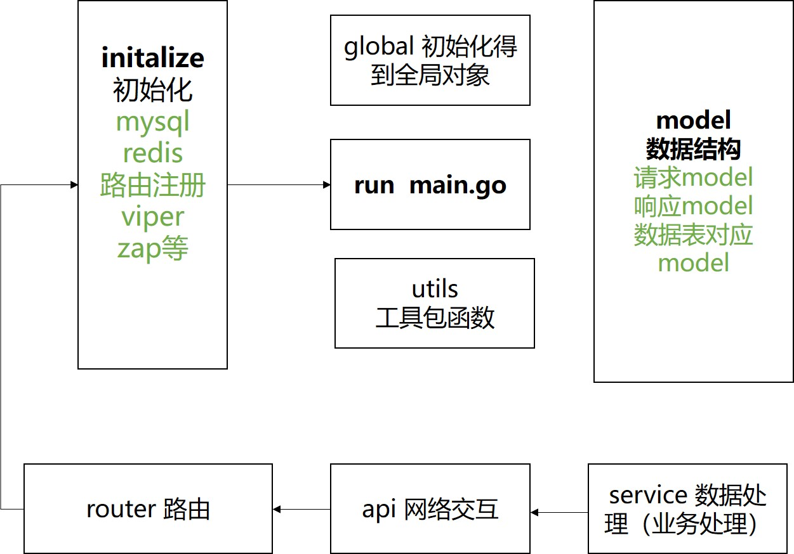

# simple-douyin

## 1.项目介绍

* **2022年字节跳动第三届青训营后端开发极简版抖音项目**,**侧重服务端实现**，根据[接口文档](https://www.apifox.cn/apidoc/shared-8cc50618-0da6-4d5e-a398-76f3b8f766c5)实现对应的功能接口，并使用提供的客户端client.apk进行功能验证和调试。
* **已完成接口**：
  * **基础接口**：支持所有用户刷抖音，按投稿时间倒序推出，登录用户可以自己拍视频投稿，查看自己的基本信息和投稿列表，注册用户流程简化；
    * 视频流接口 /douyin/feed
    * 用户注册    /douyin/user/register/
    * 用户登录    /douyin/user/login/
    * 用户信息   /douyin/user/
    * 投稿接口   /douyin/publish/action/
    * 发布列表   /douyin/publish/list/

  * **扩展接口-I**:登录用户可以对视频点赞，并在视频下进行评论，在个人主页能够查看点赞视频列表；
    * 点赞操作   /douyin/favorite/action/
    * 点赞列表  /douyin/favorite/list/
    * 评论操作  /douyin/comment/action/
    * 评论列表  /douyin/comment/list/

  * **扩展接口-II**:登录用户可以关注其他用户，能够在个人信息页查看本人的关注数和粉丝数，点击打开关注列表和粉丝列表。
    * 关注操作  /douyin/relation/action/
    * 关注列表  /douyin/relation/follow/list/
    * 粉丝列表  /douyin/relation/follower/list/


## 2.项目使用

```
go版本：v1.18;

# 克隆项目
git clone https://github.com/lihao20110/simple-douyin.git

# 进入server文件夹,使用 GoLand等编辑工具，打开server目录,不可以打开simple-douyin目录
cd server

#环境配置
安装MySQL,Redis,进行FFmpeg配置如下
MySQL使用server/douyin.sql文件建表
mv config.yaml.example config.yaml
使用viper管理项目环境变量，需配置对应配置文件server/config.yaml，如MySQL、Redis参数等

#安装依赖
go mod tidy
#运行
go run main.go

#客户端使用，设置服务端地址
安装apk后，打开在未登录情况下，双击页面右下角的“我”打开高级设置，配置服务端项目运行的前缀地址，如http://192.168.1.1:8080
```

### FFmpeg配置

* 本项目使用`ffmpeg`实现获取视频缩略图

* **介绍**：FFmpeg 是一个开放源代码的自由软件，可以执行音频和视频多种格式的录影、转换、串流功能 官网:https://ffmpeg.org/about.html
* **go工具库使用**：https://github.com/u2takey/ffmpeg-go
  * go get -u github.com/u2takey/ffmpeg-go
  * imaging 依赖：go get -u github.com/disintegration/imaging 
  * 配置环境变量：https://ffbinaries.com/downloads，下载对应系统环境下的可执行文件，如windows环境选择**windows-64**下载解压得到一个 .exe 文件，放置到 GOPATH 下的 bin 目录即可，ffmpeg -version验证；Linux版本类似。

## 3.项目架构

### 3.1 server后端架构

* 本项目架构参考[**gin-vue-admin**](https://github.com/flipped-aurora/gin-vue-admin)后端架构实现，如图

### 3.2.目录结构

```text
├──api                  # api层
|   ├──v1               # v1版本接口
├── config              # 配置包，config.yaml对应的配置结构体
├── global              # 全局对象
├── initialize           # 初始化，viper,router,gorm,redis,zap等的初始化
├── log                 # zap日志信息存储
├── middleware          # 中间件层，用于存放 gin 中间件代码
│   └── jwt.go          # jwt鉴权
├── model               # 模型层，模型对应数据表
│   ├── request         # 入参结构体，接收前端发送到后端的数据。
│   ├── response        # 出参结构体，返回给前端的数据结构体
│   └── sys_xxx.go      # mysql数据库表对应的结构体
├── public              # 视频、封面本地保存位置
├── router              # 路由层
├── service             # service逻辑层,存放业务逻辑问题
├── utils               # 工具包,工具函数封装
├── config.yaml         # 配置文件
├── go.mod
├── go.sum
├── main.go             # 项目运行入口
└── README.md
```
